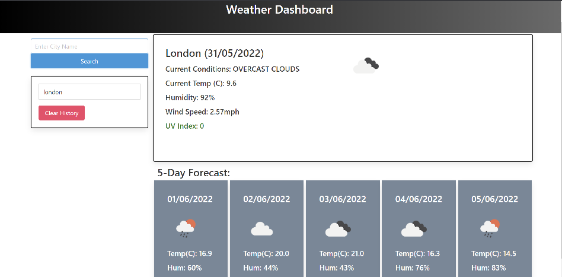
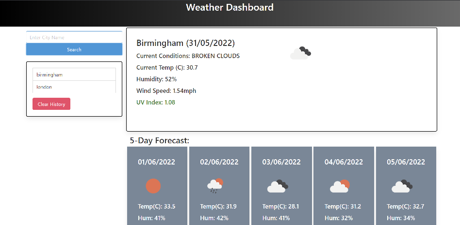

# Weather-dashboard

For this project we were tasked to create a weather dashboard. It had to show a 5 day forecast for the current city amongst many other things. It had to use local storage and also call from that local storage to display past searches.

Link to site:

Tools used in the making of this:

- HTML
- CSS/ Bulma
- Javascript
- JQuery
- Moment.js

A picture to show the dashboard in action:

This image shows the 5 day forecast but also a colour coded UV index depending on the severity; green - low, yellow - medium, red- high.

This next image shows the history of the dashboard:

Upon clicking the clear history button, the searches will be erased from the local storage and thus the web page.
